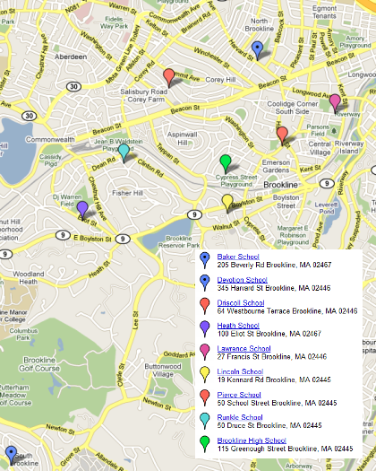

This is **not** the official B-SPACE page, which is over at http://www.brooklinema.gov/index.php?option=com_content&view=article&id=1503&Itemid=1742 ... rather it's an attempt by [a Brookline parent](http://thedurbins.com/phil/devo) to highlight some information.

## FAQ PDF from April 2, 2013

Of particular interest may be the [FAQ][] that was posted on the B-SPACE [files][] page April 2, 2013, a PDF which covers these questions: 

[files]: http://www.brooklinema.gov/index.php?option=com_docman&Itemid=1744

1. What's the Scope of the Problem?
2. What's possible or impossible? Why?
3. What other considerations are important?
4. What new school models/plans meet the requirements and considerations listed?
    - 8th Grade at OLS then a new 8th-9th School
    - New K-8 Neighborhood Elementary School
    - Two-Building "Super" Elementary School
5. Are any "innovation" models still being considered, such as a 6th grade campus or concept school?
6. Where would Brookline build a new school building? Possibly:
    - [Baldwin School](https://maps.google.com/maps?q=brookline+baldwin+school&hl=en&hq=brookline+baldwin+school&t=m&z=14&iwloc=A)
    - [Lynch Center](https://maps.google.com/maps?q=lynch+center&ll=42.336342,-71.113129&spn=0.034959,0.084543&fb=1&gl=us&hq=lynch+center&hnear=0x89e3652d0d3d311b:0x787cbf240162e8a0,Boston,+MA&cid=0,0,8939859993972233950&t=m&z=14&iwloc=A)
7. I thought Brookline owned lots of land and buildings. What about the field in front of the high school, Larz Anderson, Putterham Golf Course, the libraries, or even Town Hall?
8. Why aren't we just building modulars at every school and calling the problem solved?
9. What will it cost to build a new school building? Can the Town afford it?
10. If the operating budget for the schools is in trouble AND we have to build a new school, does that mean both a Debt Exclusion Override and a Property Tax Operating Override?
11. How much of a tax increase would this mean for Brookline homeowners?
12. What happens if we decide to build a new school and an override fails to pass?

[FAQ]: http://www.brooklinema.gov/index.php?option=com_docman&task=doc_download&gid=7695&Itemid=1744

## April 8, 2013 B-SPACE Public Hearing

If you missed the B-SPACE Public Hearing on April 8, you can watch it at http://www.youtube.com/watch?v=nVKleqdk-EA

<iframe width="560" height="315" src="http://www.youtube.com/embed/nVKleqdk-EA" frameborder="0" allowfullscreen></iframe>

## Map of Brookline schools

From http://www.brookline.k12.ma.us/index.php?option=com_content&view=article&id=47&Itemid=58

## Ways to be heard

1. By emailing the addresses listed at the bottom of the [FAQ][] PDF from April 2, 2013 with the subject "Comments on New School Options"
    - alan_morse@brookline.k12.ma.us
    - robin_coyne@brookline.k12.ma.us
    - betsy@betsydewitt.com
2. By participating in https://www.facebook.com/groups/BrooklineNewSchool/
3. By participating in http://brooklineschools.freeforums.net
4. By taking the "independent survey to gather views on recent enrollment increases" at http://www.surveymonkey.com/s/66YYNJ2 ... http://www.lincolnschoolpto.org/lincoln-lines-april-9-2012-vol-6-no-27 says this about the survey: "A group of Brookline parents has created an independent survey to gather information on parent views of the various possibilities on the table to deal with recent enrollment increases. It is not affiliated with the School committee or with B-SPACE."

